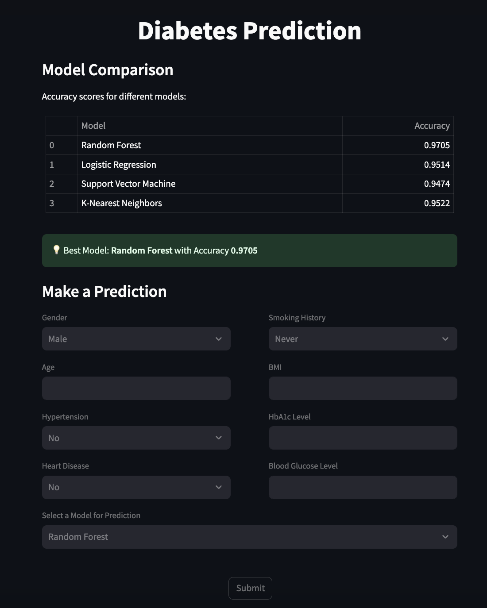

# 🩺 Diabetes Prediction using Machine Learning

A machine learning project that predicts the likelihood of diabetes using various classification models trained on the Pima Indians Diabetes Dataset.

## 

## 🧠 Overview

This project applies machine learning algorithms to predict whether a patient is likely to have diabetes based on diagnostic measurements such as glucose level, BMI, age, and more. It includes data preprocessing, model training, evaluation, and optionally a basic web interface for predictions.

---

## ✅ Features

- Data cleaning and preprocessing
- Trained models: Decision Tree, Random Forest, SVM, etc.
- Model evaluation using accuracy, precision, recall, and F1-score
- Optionally includes a web-based interface (Flask/Streamlit)

---

## 🚀 Getting Started

### 1. Clone the repository

```bash
git clone https://github.com/ishan2651712/ishan2651712-Diabetes-Prediction-using-Machine-Learning.git
cd ishan2651712-Diabetes-Prediction-using-Machine-Learning
```

### 2. Install dependencies

```bash
pip install -r requirements.txt
```

### 3. Run the app

```bash
streamlit run app.py
```
